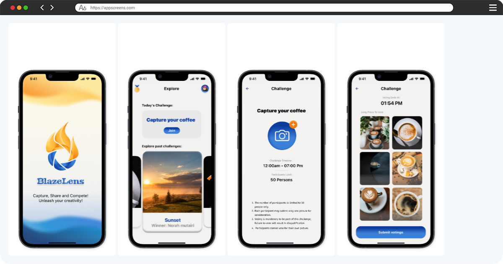

<section id="projects">
  <h2>My Projects</h2>
  
  <h3>Istaqim Project - Artificial Intelligence</h3>
  
In this project, I was responsible for the **artificial intelligence** part of the **Istaqim** application, which aims to help Muslims correct their prayer. I used techniques such as computer vision and **YOLO** to analyze and correct movements during the prayer.

  
  <h4>Technologies Used:</h4>
  <ul>
    <li>OpenCV and TensorFlow for analyzing videos using artificial intelligence.</li>
    <li>Error detection and correction algorithms based on AI.</li>
    <li>**YOLO** algorithm for real-time movement detection.</li>
  </ul>
  
  <h4>Project Screenshots:</h4>
 

  <h3>BlazeLens</h3>
  
<strong>Duration:</strong> Mar 2024 – May 2024

  
<strong>About:</strong> An app that helps people who need motivation to capture photos by gamifying the process of taking photos and encouraging users to participate in challenges and compete with others.

  
<strong>Skills:</strong> iOS App Developer · GitHub · Swift · CloudKit · Gamification · Application Programming Interfaces (API)

  
  
  <h3>KidZoology App</h3>
  
<strong>Duration:</strong> Dec 2023 – Jan 2024

  
<strong>About:</strong> An app that provides information and activities for kids to understand the animal environment by choosing animals and providing information about them.

  
<strong>Skills:</strong> SwiftUI · Education · Swift · Gamification · Mobile Application Development · Database Tools · Xcode · Application Programming Interfaces (API)

 
  
  <h3>Hi'hum App</h3>
  
<strong>Duration:</strong> Nov 2023 – Dec 2023

  
<strong>About:</strong> An app that helps tourists plan their visit to Saudi Arabia by providing a customized planner and interactive map with full guidelines about Saudi regulations and rules.

  
<strong>Skills:</strong> SwiftUI · iOS App Developer · Program Development · Swift · CloudKit · Gamification · Mobile Application Development · Database Tools · Xcode · Application Programming Interfaces (API)

  
<a href="https://github.com/rahafibrahim21/Rahaf_portfolio" target="_blank">For more details on GitHub</a>

</section>
